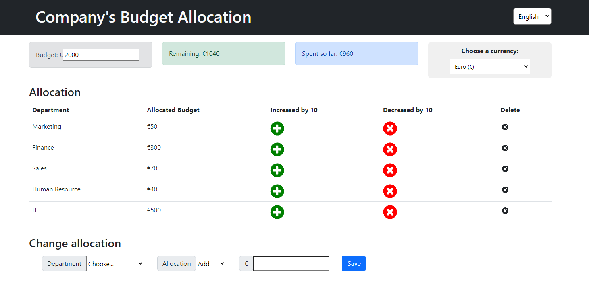

# React Budget Allocation App

## Setup
To run this project locally, follow these steps:

1. Clone the repository to your local machine using `git clone`.
2. Navigate to the project directory.
3. Install dependencies using `npm install`.
4. Start the development server using `npm start`.
5. Open your browser and visit `http://localhost:3000` to see the app in action.

## Contributing

If you'd like to contribute to this project, feel free to fork the repository and submit a pull request with your changes. Contributions are always welcome!

## Screenshots for sure
